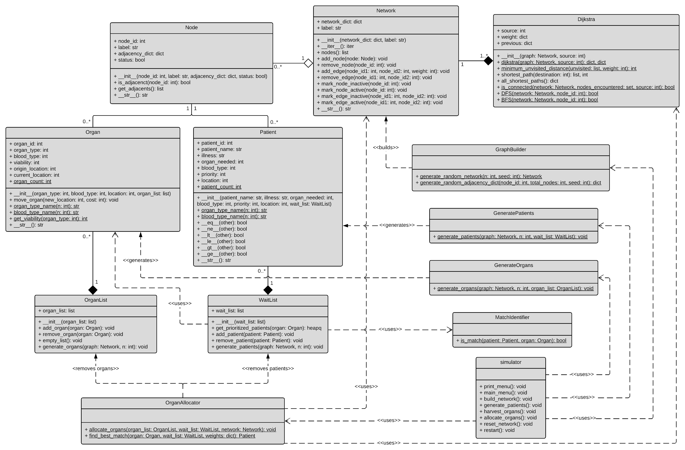

# Network Simulation

This project is designed to simulate an organ transplant system. Its aim is to simulate the organ transplant matching process, and to compare different allocation strategies for finding the best matches. To accomplish this, there will be a list of patients in need of an organ transplant within a given network of hospitals. After organs are harvested from a deceased organ donor, the system finds a match by looking at the list of patients, then the organ is allocated to the matched patient.

**<ins>The following criteria determine whether a match is feasible</ins>:**
1. The patient's need must be of the same organ type (kidney, lungs, heart, etc.)
2. The patient must be of a compatible blood type (example: patient: AB-, organ: B-)
3. The organ must be able to be transported to the patient's hospital, and leave enough time to complete the transplant procedure, before it's no longer viable (both are organ-specific - see `Organ.get_viability`/`Organ.get_operation_buffer`)

**<ins>Which feasible match is chosen depends on the selected allocation strategy</ins>** (see `network_simulator.allocation`) - see [Allocation Strategies](#allocation-strategies) below.

## Classes

### <ins>Node</ins>
The smallest element within the network is a Node object. Each node represents a specific hospital where both patients and organs can be located. These will represent the 'addresses' of sources and destinations within the graph based on an organ's location and the matched patient's location.

**<ins>Nodes consist of</ins>:**
1. `node ID` - a unique identifier
2. `label` - describes/names the node
3. `adjacency dictionary` - where the adjacent node's id is the key and another dictionary with two entries is the value. This allows each edge to have two important attributes - weight and status (active or inactive)
4. `status` - indicates if a node is active or inactive. If the node is inactive, all edges contained in the adjacency list are consequently inactive as well

### <ins>Network</ins>
The network is a graph that is represented as a collection of nodes. The network represents the entire network of hospitals. The network will be traversed from node to node to. The weights of individual edges traveled will be added together to represent the total cost of the traveled path.

**<ins>Networks consist of</ins>:**
1. `network dictionary` - contains a collection of `node IDs` that point to their corresponding `Node` objects
2. `label` - describes/names the graph

### <ins>Other Classes</ins>
-  `Dijkstra` - finds all shortest paths from a source node in a given graph
-  `BloodType` - indicates blood type by letter and polarity (also checks for compatibility between donors and recipients)
-  `Organ` - represents a donated organ available for transplant (these will be distributed across the system)
-  `Patient` - represents an individual in need of a transplant
-  `OrganList` - represents all donor organs currently available to be allocated to patients
-  `WaitList` - represents all patients in need of a transplant
-  `GraphBuilder` - builds a random network with N nodes
-  `OrganGenerator` - simulates harvesting organs from N patients where each organ has a 75% of being successfully harvested and adds the generated organs to an `OrganList`
-  `PatientGenerator` - generates N patients each with a random organ need, blood type, priority, and location (`node_id`) and adds the generated patients to a `WaitList`
-  `ConnectivityChecker` - determines if a given graph is connected 
-  `SubnetworkGenerator` - takes a `Network` and a collection (`OrganList` or `WaitList`) and creates a subnetwork containing only nodes where elements of the collection are present
-  `GraphConverter` - converts a `Network` to a `NetworkX` (graph library) object
-  `distance` - computes real-world hospital distances (haversine) and estimated transit time directly from coordinates, instead of scraping a distance-lookup site

### <ins>Scripts</ins>
- `generate_networks.py` - creates, serializes, and exports random graph
- `make_tsv.py` - gnerates random edge list in TSV format (for IO)
- `import_edge_list.py` - converts edge list format to `Network`

### <ins>Allocation Strategies</ins>
`network_simulator.allocation` decides *which* feasible organ/patient pairs to actually form. A strategy is a (matcher, scorer) pair - the two axes are independent, so strategies can be compared to see whether a result is driven by the matching algorithm, the scoring model, or both:

- **Matchers** (`allocation.matchers`) - *how* matches are chosen:
  - `GreedyMatcher` - processes organs one at a time, assigning each to its highest-scoring available patient (the project's original behavior)
  - `OptimalMatcher` - solves one allocation batch as a maximum-weight bipartite matching (via `networkx`), so an earlier low-value match can't crowd out a better one available for a later organ
- **Scorers** (`allocation.scoring`) - *how* a match is valued:
  - `PriorityScore` - ranks purely by the patient's priority attribute
  - `CompositeScore` - combines urgency (priority), time already spent on the wait list, and travel cost, inspired by real OPTN/UNOS allocation policy

`STRATEGIES` (in `allocation.strategies`) exposes four named combinations (`baseline`, `optimal_priority`, `optimal_composite`, `greedy_composite`) that `execute/benchmark_strategies.py` runs across many randomized multi-round simulations to compare - organs transplanted, organs wasted, priority served, and a fairness spread across priority tiers.

### <ins>Simulator</ins>
The `Simulator` is designed to create an interactive experience that can be executed through any console. The simulator does this by harnessing the functionality of the `GraphBuilder`, `PatientGenerator`, `OrganGenerator`, and `network_simulator.allocation` classes, including choosing which allocation strategy to use. This allows users to choose the number of nodes in the network, number of patients on the wait list, and number of bodies to harvest organs from all on the fly.

## UML Diagram

Note: predates the allocation-strategy package described above; kept for the original graph/patient/organ model.
